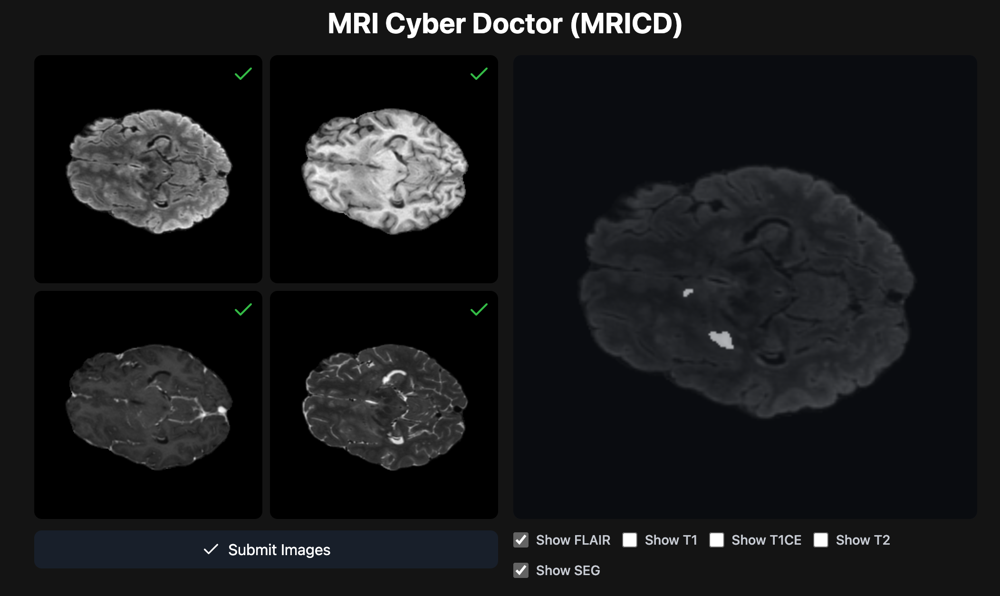

# MRI Cyber Doctor (MRICD)

## Overview

MRI Cyber Doctor (MRICD) is a project aimed at processing MRI images using a UNet model to segment and analyze brain tumors. The project includes a Flask-based web application that allows users to upload MRI images and receive processed results.

## Installation

To install and run the project, follow these steps:

1. **Clone the repository:**
   ```bash
   git clone https://github.com/Lyan9145/MRICD.git
   cd MRICD
   ```

2. **Install dependencies:**
   - For NPU(Huawei Accend devices):
     ```bash
     pip install -r requirement_npu.txt
     ```
   - For PC:
     ```bash
     pip install -r requirement_pc.txt
     ```

3. **Download the pre-trained model checkpoint:**
   - The model checkpoint should be placed in the `ckpt/` directory. The latest checkpoint will be automatically loaded by the application.

4. **Download the BraTS2021 dataset:**
   - The dataset is required for training the model. Download it from [BraTS2021](https://www.kaggle.com/datasets/dschettler8845/brats-2021-task1).
   - Place the dataset under the `data/datasets/` folder.

## Usage

1. **Run the Flask server:**
   ```bash
   python server.py
   ```
   The server will start on `localhost` at the specified port (default is `5674`).

2. **Access the web interface:**
   Open your browser and navigate to `http://localhost:5674`.

3. **Upload MRI images:**
   - Use the web interface to upload the required MRI images (FLAIR, T1, T1CE, T2).
   - Click the "Submit Images" button to process the images.

4. **View the results:**
   - The processed image will be displayed on the web interface.
   - You can toggle the visibility of different layers (FLAIR, T1, T1CE, T2, SEG) to analyze the results.

## File Structure

```
.
├── .gitignore
├── README.md
├── requirement_npu.txt
├── requirement_pc.txt
├── server.py
├── unet_model.py
├── ckpt/
│   ├── 0.8142160177230835_1729589887.964992.pth
│   └── README.md
├── data/
│   ├── README.md
│   ├── Nifti2Image.py
│   ├── __init__.py
│   ├── better_dataset.py
│   ├── data_preV1.py
│   ├── data_preV2.py
│   ├── datasets/
│   ├── diff.ipynb
│   ├── download_datasets.py
│   ├── glance.ipynb
│   ├── lazy_dataset.py
│   ├── nii2jpg_output/
│   └── origin_dataset.py
├── model/
│   ├── __init__.py
│   ├── init_weights.py
│   ├── layers.py
│   ├── unet_model.py
│   ├── unet_parts.py
│   ├── UNet1Plus.py
│   ├── UNet2Plus.py
│   ├── UNet3Plus.py
├── Pytorch/
├── static/
│   ├── css/
│   │   ├── remixicon.css
│   │   └── style.css
│   └── js/
│       ├── lucide.min.js
│       └── tailwindcss.js
├── templates/
│   └── index.html
└── train/
    ├── __init__.py
    ├── dice_loss.py
    ├── eval.ipynb
    ├── evaluate.py
    ├── train_lazy.py
    ├── train_ram.py
    └── datasets/
```

## Key Components

### `server.py`

The main Flask application that handles file uploads, processes images using the UNet model, and serves the web interface.

### `unet_model.py`

Contains the `ModelUNet` class, which loads the pre-trained UNet model, processes input images, and generates segmentation masks.

### `templates/index.html`

The HTML template for the web interface. It includes a form for uploading MRI images and displaying the processed results.

### `static/`

Contains static assets such as CSS and JavaScript files used by the web interface.

### `model/`

Contains the implementation of the UNet model and related components.

### `train/`

Contains scripts and notebooks related to training the UNet model.


## Refrence:

[UNet3plus_pth](https://github.com/avBuffer/UNet3plus_pth)
[Pytorch-UNet](https://github.com/milesial/Pytorch-UNet)
[BraTS2021](https://www.kaggle.com/datasets/dschettler8845/brats-2021-task1)
